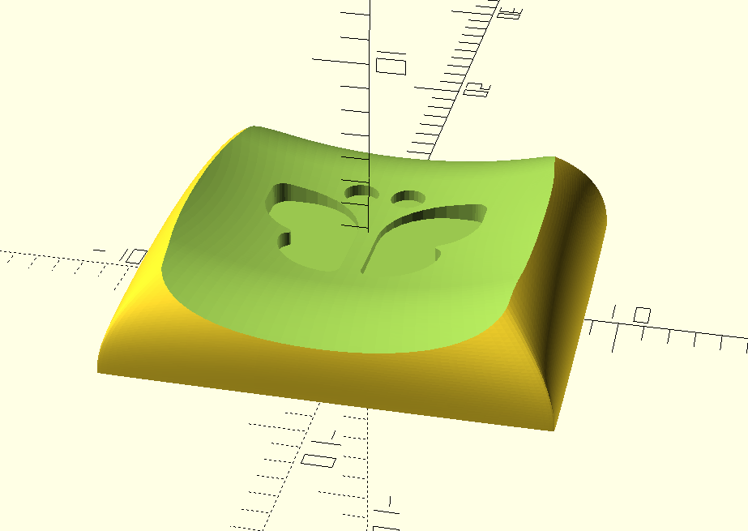

# Legends/Icons for choc stemmed keycaps 

Made by [Johann Banta](https://yooohon.com), [Instagram](https://www.instagram.com/yooohon/?hl=de), [LinkedIn](https://www.linkedin.com/in/johannbanta/)

## How to
* make sure OpenSCAD is up to date.
* unzip `libraries.zip` into your OpenSCAD libraries
* Copy the SVG you want as your legend into `SVG/`
* select keycap you want to render by changing `KeyID` value
* change `KeyID` to corresponding Parameter ID
* Update the `icon` parameter with the filename of your icon
* press F5 to review
* press F6 to render
* press F7 to export as STL

#Some notes on
## Distorted Ellipsoidal Saddle (DES)
High sculpt smooth transition profile

### Standard

### Concave

### Thumbs

### Chicago Stenographer
Subtly sculpted choc spaced low profile

#### Standard

#### Convex

#### Thumbs

Additional sculpt angle and smoother transitions

### Philadelphia Minimalist

Minimal spacing
Under construction
